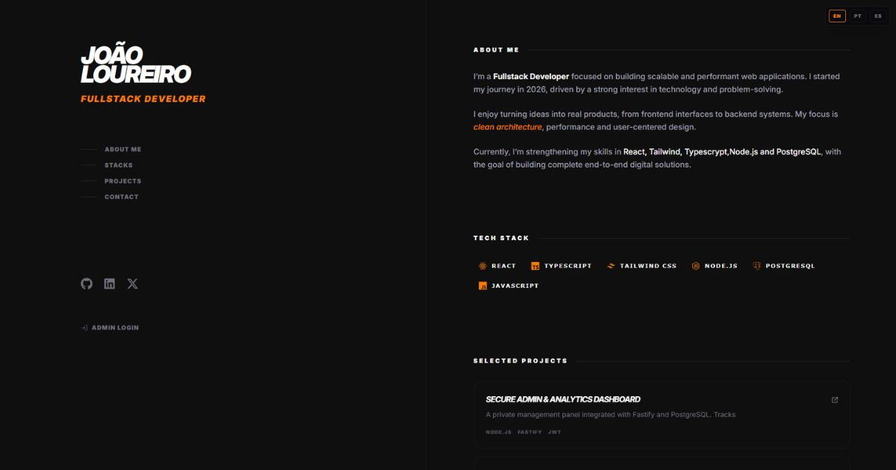

# 🚀 João Loureiro | Fullstack Portfolio Platform

<div align="center">
  

  <h3>Fullstack Developer Portfolio with Secure Analytics Dashboard & Multi-Provider Failover Infrastructure</h3>

  <p align="center">
    <a href="https://vercel.com" target="_blank">
      
    </a>
    <a href="https://railway.app" target="_blank">
      
    </a>
    <a href="https://render.com" target="_blank">
      
    </a>
    <a href="https://neon.tech" target="_blank">
      
    </a>
    <a href="https://opensource.org/licenses/MIT" target="_blank">
      
    </a>
  </p>
</div>

---

## 📸 Project Preview

<div align="center">
  
</div>

---

## 📖 About the Project

This project is a production-oriented **Fullstack Portfolio Platform** designed with a strong focus on scalability, resilience, security, and user experience.

The platform combines:
- A multilingual public portfolio website
- A protected administrative dashboard
- Custom analytics aggregation powered by the Google Analytics 4 API
- Smart backend failover infrastructure across multiple cloud providers

Instead of relying exclusively on third-party analytics dashboards, the backend aggregates and processes GA4 data directly into a private administrative workspace, allowing centralized monitoring and visitor insight management.

The architecture emphasizes:
- Low-latency frontend performance
- Infrastructure redundancy
- Secure admin access
- Responsive multilingual experience (**PT / EN / ES**)

---

## ✨ Features

- 🌍 Trilingual interface (Portuguese, English, Spanish)
- 🔐 Protected admin authentication system
- 📊 Google Analytics 4 API integration
- ⚡ Smart API retry and failover routing
- ☁️ Multi-provider backend deployment strategy
- 🛡️ Rate limiting and bot protection mechanisms
- 📱 Fully responsive UI/UX
- 🚀 Optimized frontend delivery using Vite + Vercel
- 📈 Centralized visitor analytics dashboard

---

## 🧰 Tech Stack

### Frontend
- React
- TypeScript
- Vite
- TailwindCSS

### Backend
- Fastify
- PostgreSQL
- JWT Authentication

### Infrastructure & Deployment
- Vercel
- Railway
- Render
- Neon Database

---

## 🏗️ Architecture Overview

```text
┌──────────────────────────────┐
│          Frontend            │
│   React + TypeScript + Vite  │
│           (Vercel)           │
└──────────────┬───────────────┘
               │
               ▼
┌──────────────────────────────┐
│       Smart API Router       │
│  Retry Logic + Failover      │
└──────────────┬───────────────┘
               │
     ┌─────────┴─────────┐
     ▼                   ▼
┌───────────────┐   ┌───────────────┐
│ Primary API   │   │ Secondary API │
│   Railway     │   │    Render     │
│    Fastify    │   │    Fastify    │
└──────┬────────┘   └──────┬────────┘
       │                   │
       ▼                   ▼
┌───────────────┐   ┌───────────────┐
│ PostgreSQL    │   │ Neon Postgres │
│ Primary DB    │   │ Backup DB     │
└───────────────┘   └───────────────┘
```

---

## 📦 Installation

Clone the repository:

```bash
git clone https://github.com/yourusername/your-repository.git
cd your-repository
```

Install dependencies for both frontend and backend:

```bash
# Frontend
cd frontend
npm install

# Backend
cd ../backend
npm install
```

---

## ⚙️ Environment Variables

Create a `.env` file inside the backend directory:

```env
PORT=3000

DATABASE_URL=your_postgres_url

JWT_SECRET=your_jwt_secret

GA4_PROPERTY_ID=your_ga4_property_id
GA4_CLIENT_EMAIL=your_google_service_email
GA4_PRIVATE_KEY=your_google_private_key
```

Frontend `.env` example:

```env
VITE_API_URL=http://localhost:3000
```

---

## ▶️ Running Locally

Start the backend server:

```bash
cd backend
node src/server.js
```

Start the frontend application:

```bash
cd frontend
npm run dev
```

Frontend:
```text
http://localhost:5173
```

Backend:
```text
http://localhost:3000
```

---

## 📁 Project Structure

```text
root/
├── frontend/
│   ├── public/
│   ├── src/
│   └── vite.config.ts
│
├── backend/
│   ├── src/
│   ├── routes/
│   ├── middleware/
│   └── services/
│
└── README.md
```

---

## 🔒 Security Highlights

- JWT-based authentication
- Protected admin routes
- HTTP security headers
- Request validation
- Rate limiting middleware
- Bot protection hooks
- Environment variable isolation

---

## 🚀 Deployment Strategy

The application uses a multi-provider deployment strategy:

- Frontend hosted on Vercel
- Primary backend deployed on Railway
- Secondary failover backend deployed on Render
- Backup database hosted on Neon

The frontend router automatically retries failed requests and redirects traffic to the secondary backend if the primary service becomes unavailable.

---

## 📄 License

This project is licensed under the MIT License.